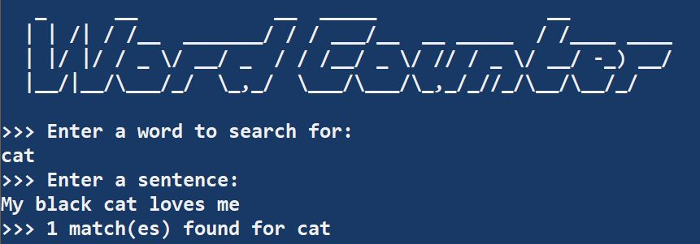
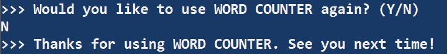

# [Word Counter](https://github.com/ayohana/WordCounter.git/)

#### Intermediate C# & Testing Exercise for [Epicodus](https://www.epicodus.com/), 03.06.2020

#### By [**Adela Darmansyah**](https://ayohana.github.io/portfolio/)

## Description

**This C# console application counts how frequently a word appears in a sentence.** A user will be able to enter a word and a sentence. The application will check for **_full word matches_** and show the number of matches. Examples:
* A user enters the word _"cat"_ and sentence _"My black cat loves me"_
  - The application will show _1 match result for "cat"_.
* A user enters the word _"cat"_ and sentence _"I'm walking to the cathedral"_
  - The application will show _0 match result for "cat"_.

## Screenshots

#### Example of using the application:

#### When a user enters multiple words to search for:

#### Search results are for _full word matches_ only:

#### User can choose to exit the application:

## Specs

  
Click to expand!

| Spec | `Console` Input | `Console` Output |
| :-------------     | :------------- | :------------- |
| **Program Gathers and Stores User Input of Word to Search For** | cat | `Stored:` cat |
| **Program Gathers and Stores User Input of a Sentence** | My black cat loves me | `Stored:` My black cat loves me |
| **Program Checks if Sentence Contains Word** | cat, My black cat loves me | True |
| **Program Displays No Match Found if Sentence Does Not Contain the Word** | cat, My black dog loves me | 0 match for cat |
| **Program Finds the Word and Counts a Single Match** | cat, My black cat loves me | 1 match for cat |
| **Program Continues Search and Counts Multiple Matches** | cat, My black cat and my white cat love their toys more than me | 2 matches for cat |
| **Program Counts Full Word Matches Only** | cat, I'm walking to the cathedral | 0 match for cat |
| **Program Is Case Insensitive** | Cat, My black cAt loves me | 1 match for cat |
| **Program Returns Invalid Input if Word Input Consists of Multiple Words** | black cat | Invalid input. Please enter 1 word only. |
| **Program Returns Invalid Input if Word Input is Null or Empty** | `no input` | Invalid input. Please enter 1 word only. |

## Setup/Installation Requirements

* Download [.NET Core](https://dotnet.microsoft.com/download/dotnet-core/)
* Clone this [repository](https://github.com/ayohana/WordCounter.git/)
* Open the `Command Line Interface`.
  * Navigate into the `WordCounter` directory.
    * Type in the command `dotnet restore` to gather tools and dependencies for the application.
    * Type in the command `dotnet run` to run the application.
  * Navigate into the `WordCounter.Tests` directory.
    * Type in the command `dotnet restore` to gather tools and dependencies for the tests.
    * Type in the command `dotnet test` to run the tests. 

## Known Bugs

No known bugs at this time.

## Support and contact details

Feel free to provide feedback via email: adela.yohana@gmail.com.

## Technologies Used

* C#
* [.NET Core](https://dotnet.microsoft.com/download/dotnet-core/)
* Markdown
* Behavior Driven Development workflow

### License

This C# console application is licensed under the MIT license.

Copyright (c) 2020 **Adela Darmansyah**